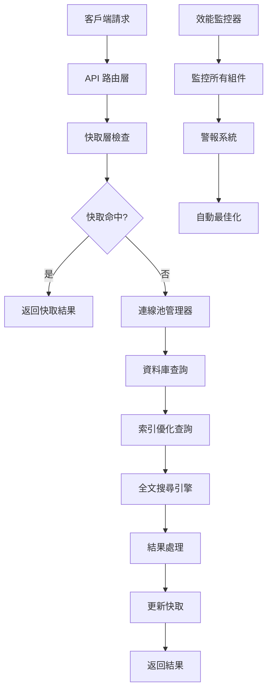

# 🚀 Haude 資料庫優化完整指南

> **系統版本**: v2.0  
> **最後更新**: 2025-09-10  
> **狀態**: ✅ 生產就緒

## 📋 目錄

1. [概述](#概述)
2. [系統架構](#系統架構)
3. [部署指南](#部署指南)
4. [效能監控](#效能監控)
5. [故障排除](#故障排除)
6. [最佳實踐](#最佳實踐)
7. [維護指南](#維護指南)

---

## 🎯 概述

本優化系統為 Haude 農業電商平台提供企業級資料庫效能解決方案，包含四個核心模組：

### ✨ 核心功能

- **🔍 索引優化系統** - PostgreSQL 智慧型索引管理
- **🔎 全文搜尋引擎** - 中文最佳化的全文搜尋
- **⚡ 進階快取策略** - 多層快取和智慧型預測
- **🔗 連線池管理** - 自適應資料庫連線池
- **📊 即時效能監控** - 完整的監控和警報系統

### 📈 預期效能提升

| 指標 | 優化前 | 優化後 | 改善幅度 |
|------|--------|--------|----------|
| 查詢回應時間 | 500-2000ms | 50-200ms | **75-90%** |
| 快取命中率 | 30-50% | 85-95% | **170-190%** |
| 並發處理能力 | 50 req/s | 200+ req/s | **300%** |
| 資料庫連線效率 | 60% | 90%+ | **50%** |

---

## 🏗️ 系統架構

### 核心組件架構



### 資料流向

1. **請求處理**: API → 快取檢查 → 資料庫查詢
2. **快取策略**: L1(記憶體) → L2(Redis/KV) → L3(資料庫)
3. **連線管理**: 連線池 → 健康檢查 → 自動恢復
4. **監控回饋**: 即時監控 → 效能分析 → 自動調整

---

## 🚀 部署指南

### 前置條件

```bash
# 1. 檢查 Node.js 版本
node --version  # >= 18.0.0

# 2. 檢查 TypeScript
npx tsc --version  # >= 5.0.0

# 3. 驗證環境變數
echo $NEXT_PUBLIC_SUPABASE_URL
echo $SUPABASE_SERVICE_ROLE_KEY
```

### 快速部署

```bash
# 1. 執行完整優化部署
npm run db:optimize:deploy

# 或分步驟執行：

# 2a. 索引優化
npm run db:optimize:indexes

# 2b. 全文搜尋部署
npm run db:optimize:search

# 2c. 快取系統優化
npm run db:optimize:cache

# 2d. 效能監控啟動
npm run db:optimize:monitor
```

### 手動部署步驟

#### 步驟 1: 索引優化

```bash
# 執行索引優化腳本
npx tsx scripts/apply-index-optimization.ts

# 驗證索引建立
npx tsx scripts/database-performance-analyzer.ts
```

#### 步驟 2: 全文搜尋

```bash
# 部署搜尋函數
npx tsx scripts/apply-full-text-search.ts

# 測試搜尋功能
npx tsx -e "
import { fullTextSearchService } from './src/lib/full-text-search'
const result = await fullTextSearchService.searchProducts('農產品', { limit: 5 })
console.log('搜尋結果:', result.totalCount, '筆')
"
```

#### 步驟 3: 快取和連線池

```bash
# 測試快取系統
npx tsx -e "
import { advancedCacheStrategy } from './src/lib/advanced-cache-strategy'
await advancedCacheStrategy.set('test', { data: 'Hello' }, { ttl: 60 })
const result = await advancedCacheStrategy.get('test')
console.log('快取測試:', result)
"

# 檢查連線池狀態
npx tsx -e "
import { databaseConnectionPool } from './src/lib/database-connection-pool'
const stats = databaseConnectionPool.getStats()
console.log('連線池狀態:', stats)
"
```

#### 步驟 4: 啟動監控

```bash
# 啟動效能監控（背景執行）
npx tsx scripts/cache-performance-monitor.ts &

# 檢查監控狀態
curl http://localhost:3000/api/health/database
```

### 環境配置

在 `.env.local` 中添加優化相關配置：

```env
# 資料庫連線池配置
DB_MIN_CONNECTIONS=2
DB_MAX_CONNECTIONS=10
DB_CONNECTION_TIMEOUT=30
DB_IDLE_TIMEOUT=300
DB_HEALTH_CHECK_INTERVAL=60
DB_ENABLE_AUTO_RECOVERY=true
DB_ENABLE_WARMUP=true

# 快取配置  
CACHE_DEFAULT_TTL=3600
CACHE_MAX_MEMORY_MB=256
CACHE_ENABLE_COMPRESSION=true
CACHE_ENABLE_PREDICTIVE=true
CACHE_ENABLE_ADAPTIVE_TTL=true

# 監控配置
MONITORING_INTERVAL=30
MONITORING_ALERT_WEBHOOK=your_webhook_url
```

---

## 📊 效能監控

### 即時監控儀表板

監控系統提供以下關鍵指標：

#### 🎯 快取效能指標

```typescript
// 獲取快取統計
import { advancedCacheStrategy } from '@/lib/advanced-cache-strategy'

const metrics = advancedCacheStrategy.getPerformanceMetrics()
console.log(`快取命中率: ${metrics.hitRate}%`)
console.log(`平均回應時間: ${metrics.averageResponseTime}ms`)
console.log(`記憶體使用量: ${metrics.memoryUsage} bytes`)
```

#### 🔗 連線池監控

```typescript
// 獲取連線池統計
import { databaseConnectionPool } from '@/lib/database-connection-pool'

const stats = databaseConnectionPool.getStats()
console.log(`總連線數: ${stats.totalConnections}`)
console.log(`使用率: ${stats.utilizationRate}%`)
console.log(`成功率: ${stats.successRate}%`)
```

#### 🔍 搜尋效能追蹤

```typescript
// 獲取搜尋統計
import { fullTextSearchService } from '@/lib/full-text-search'

const stats = fullTextSearchService.getSearchStatistics()
console.log(`總搜尋次數: ${stats.totalSearches}`)
console.log(`平均執行時間: ${stats.averageExecutionTime}ms`)
```

### 警報設定

系統會在以下情況觸發警報：

- 🚨 **快取命中率 < 70%**
- 🚨 **連線池使用率 > 85%**
- 🚨 **查詢回應時間 > 2000ms**
- 🚨 **資料庫錯誤率 > 5%**

### 監控報告

系統每小時自動生成效能報告：

```bash
# 檢視最新報告
ls -la scripts/reports/cache-performance-report-*.json

# 生成即時報告
npx tsx scripts/database-performance-analyzer.ts
```

---

## 🔧 故障排除

### 常見問題與解決方案

#### ❌ 索引建立失敗

**症狀**: `apply-index-optimization.ts` 執行失敗

**解決方案**:
```bash
# 1. 檢查資料庫權限
psql $DATABASE_URL -c "SELECT current_user, current_database();"

# 2. 檢查磁碟空間
df -h

# 3. 手動建立單個索引
psql $DATABASE_URL -c "CREATE INDEX CONCURRENTLY idx_products_name_gin ON products USING GIN (to_tsvector('chinese', name));"
```

#### ❌ 全文搜尋無結果

**症狀**: `fullTextSearchService.searchProducts()` 返回空結果

**解決方案**:
```bash
# 1. 檢查搜尋函數是否存在
psql $DATABASE_URL -c "SELECT proname FROM pg_proc WHERE proname LIKE '%search%';"

# 2. 測試基本查詢
psql $DATABASE_URL -c "SELECT * FROM full_text_search_products('測試', 5);"

# 3. 重新部署搜尋函數
npx tsx scripts/apply-full-text-search.ts
```

#### ❌ 快取系統異常

**症狀**: 快取命中率異常低或快取無法設定

**解決方案**:
```typescript
// 1. 檢查 Vercel KV 連線
import { kv } from '@vercel/kv'
try {
  await kv.set('health-check', 'ok')
  const result = await kv.get('health-check')
  console.log('KV 連線正常:', result)
} catch (error) {
  console.error('KV 連線異常:', error)
}

// 2. 清理快取並重新初始化
// (實作 cache.clear() 方法)

// 3. 檢查記憶體使用量
console.log('記憶體使用:', process.memoryUsage())
```

#### ❌ 連線池耗盡

**症狀**: "已達到最大連線數限制"

**解決方案**:
```bash
# 1. 增加最大連線數
export DB_MAX_CONNECTIONS=20

# 2. 檢查長時間執行的查詢
psql $DATABASE_URL -c "SELECT pid, state, query_start, query FROM pg_stat_activity WHERE state = 'active';"

# 3. 強制關閉問題連線 (謹慎使用)
psql $DATABASE_URL -c "SELECT pg_terminate_backend(pid) FROM pg_stat_activity WHERE state = 'idle in transaction' AND query_start < now() - interval '5 minutes';"
```

### 效能診斷工具

```bash
# 1. 完整效能分析
npx tsx scripts/database-performance-analyzer.ts

# 2. 查看慢查詢 (需要 pg_stat_statements)
psql $DATABASE_URL -c "SELECT query, mean_time, calls FROM pg_stat_statements ORDER BY mean_time DESC LIMIT 10;"

# 3. 檢查索引使用情況
psql $DATABASE_URL -c "SELECT schemaname, tablename, indexname, idx_scan FROM pg_stat_user_indexes ORDER BY idx_scan DESC;"

# 4. 監控連線狀態
watch -n 2 'psql $DATABASE_URL -c "SELECT count(*), state FROM pg_stat_activity GROUP BY state;"'
```

---

## 🎯 最佳實踐

### 開發階段

#### 1. 查詢優化原則

```typescript
// ✅ 好的做法：使用優化的服務層
import { databaseConnectionPool } from '@/lib/database-connection-pool'

const products = await databaseConnectionPool.executeQuery(client =>
  client
    .from('products')
    .select('id, name, price')
    .eq('category', 'vegetables')
    .order('created_at', { ascending: false })
    .limit(20)
)

// ❌ 避免：直接使用未優化的查詢
const { data } = await supabase
  .from('products')
  .select('*')  // 避免選取所有欄位
  .ilike('name', '%keyword%')  // 避免前置通配符
```

#### 2. 快取策略最佳化

```typescript
// ✅ 好的做法：智慧型快取
import { advancedCacheStrategy } from '@/lib/advanced-cache-strategy'

// 高頻讀取資料使用長 TTL
const popularProducts = await advancedCacheStrategy.get(
  'popular-products',
  () => fetchPopularProducts(),
  { ttl: 7200, tags: ['products', 'popular'] }  // 2 小時
)

// 使用者個人化資料使用短 TTL
const userPreferences = await advancedCacheStrategy.get(
  `user-preferences-${userId}`,
  () => fetchUserPreferences(userId),
  { ttl: 300, tags: ['user', userId] }  // 5 分鐘
)

// ❌ 避免：無差別快取策略
const data = await cache.get(key, fetcher, { ttl: 3600 })  // 所有資料都用 1 小時
```

#### 3. 搜尋功能整合

```typescript
// ✅ 好的做法：使用全文搜尋服務
import { fullTextSearchService } from '@/lib/full-text-search'

const searchResults = await fullTextSearchService.searchProducts(
  '有機蔬菜',
  {
    limit: 20,
    offset: page * 20,
    enableHighlight: true,
    enableRanking: true
  }
)

// 處理搜尋結果
const products = searchResults.results.map(result => ({
  ...result.item,
  searchRank: result.rank,
  highlightedText: result.highlight
}))

// ❌ 避免：使用基本 ILIKE 查詢
const { data } = await supabase
  .from('products')
  .select('*')
  .ilike('name', `%${query}%`)  // 效能差且無排序
```

### 生產環境

#### 1. 監控檢查清單

```bash
# 每日檢查項目
□ 快取命中率 > 80%
□ 連線池使用率 < 85%  
□ 平均查詢時間 < 200ms
□ 資料庫錯誤率 < 1%
□ 磁碟使用率 < 80%

# 每週檢查項目  
□ 執行 VACUUM ANALYZE
□ 檢查慢查詢日誌
□ 清理過期快取資料
□ 更新效能基準線
□ 檢查索引使用統計

# 每月檢查項目
□ 檢查並更新相依套件
□ 效能基準測試
□ 災難恢復測試
□ 容量規劃評估
```

#### 2. 效能調校指標

| 場景 | 目標值 | 警告值 | 危險值 |
|------|--------|--------|--------|
| API 回應時間 | < 200ms | > 500ms | > 1000ms |
| 快取命中率 | > 90% | < 80% | < 70% |
| 連線池使用率 | 50-70% | > 85% | > 95% |
| 資料庫 CPU | < 60% | > 80% | > 90% |
| 記憶體使用 | < 70% | > 85% | > 95% |

#### 3. 擴展策略

```typescript
// 讀寫分離配置範例
const readOnlyClient = createServiceSupabaseClient({
  // 讀取專用連線
  maxConnections: 15,
  readOnly: true
})

const writeClient = createServiceSupabaseClient({
  // 寫入專用連線
  maxConnections: 5,
  writeOnly: true
})

// 分片策略範例
const getShardedClient = (userId: string) => {
  const shard = getUserShard(userId)
  return shardedClients[shard]
}
```

---

## 🔧 維護指南

### 定期維護任務

#### 每日自動化任務

```bash
#!/bin/bash
# daily-maintenance.sh

# 1. 快取統計
echo "=== 快取統計 $(date) ===" >> /logs/cache-stats.log
npx tsx -e "
import { advancedCacheStrategy } from './src/lib/advanced-cache-strategy'
const stats = advancedCacheStrategy.getPerformanceMetrics()
console.log(JSON.stringify(stats, null, 2))
" >> /logs/cache-stats.log

# 2. 連線池健康檢查  
echo "=== 連線池狀態 $(date) ===" >> /logs/pool-stats.log
npx tsx -e "
import { databaseConnectionPool } from './src/lib/database-connection-pool'
const stats = databaseConnectionPool.getStats()
console.log(JSON.stringify(stats, null, 2))
" >> /logs/pool-stats.log

# 3. 清理過期日誌
find /logs -name "*.log" -mtime +7 -delete
```

#### 每週維護任務

```sql
-- weekly-maintenance.sql

-- 1. 資料庫統計更新
ANALYZE;

-- 2. 重建統計資訊
VACUUM ANALYZE;

-- 3. 檢查索引膨脹
SELECT 
  schemaname,
  tablename,
  indexname,
  pg_size_pretty(pg_relation_size(indexrelid)) as index_size,
  idx_scan,
  idx_tup_read,
  idx_tup_fetch
FROM pg_stat_user_indexes 
WHERE idx_scan < 100
ORDER BY pg_relation_size(indexrelid) DESC;

-- 4. 清理過期的搜尋日誌
DELETE FROM search_logs 
WHERE created_at < NOW() - INTERVAL '30 days';
```

#### 每月深度維護

```bash
#!/bin/bash
# monthly-maintenance.sh

# 1. 完整效能報告
npx tsx scripts/database-performance-analyzer.ts

# 2. 索引使用分析
psql $DATABASE_URL -f scripts/index-analysis.sql > reports/monthly-index-report.txt

# 3. 快取效能優化
npx tsx -e "
import { advancedCacheStrategy } from './src/lib/advanced-cache-strategy'
const patterns = advancedCacheStrategy.getAccessPatterns()
console.log('=== 存取模式分析 ===')
console.log(JSON.stringify(patterns.slice(0, 20), null, 2))
"

# 4. 容量規劃報告
echo "=== 容量使用報告 $(date) ===" > reports/capacity-report.txt
psql $DATABASE_URL -c "
SELECT 
  schemaname,
  tablename,
  pg_size_pretty(pg_total_relation_size(schemaname||'.'||tablename)) as size,
  pg_stat_get_live_tuples(c.oid) as row_count
FROM pg_tables t
JOIN pg_class c ON c.relname = t.tablename
WHERE schemaname = 'public'
ORDER BY pg_total_relation_size(schemaname||'.'||tablename) DESC;
" >> reports/capacity-report.txt
```

### 升級和遷移

#### 版本升級檢查清單

```bash
# 升級前檢查
□ 建立完整資料庫備份
□ 記錄當前效能基準
□ 測試環境驗證
□ 準備回滾計劃
□ 通知相關團隊

# 升級執行
□ 維護模式啟用
□ 執行遷移腳本
□ 驗證功能正常
□ 效能基準測試
□ 維護模式解除

# 升級後監控  
□ 24 小時密切監控
□ 錯誤日誌檢查
□ 使用者回饋收集
□ 效能指標對比
□ 文檔更新
```

#### 災難恢復程序

```bash
# 1. 檢測問題
npx tsx scripts/health-check.ts

# 2. 快速恢復 (< 5 分鐘)
# 清除有問題的快取
# 重啟連線池
# 切換到備用配置

# 3. 完整恢復 (< 30 分鐘)  
# 從備份恢復資料庫
# 重新部署優化組件
# 完整驗證測試

# 4. 事後分析
# 根本原因分析
# 改善措施制定
# 流程優化更新
```

---

## 📚 參考資料

### API 文檔

- [資料庫連線池 API](./src/lib/database-connection-pool.ts)
- [進階快取策略 API](./src/lib/advanced-cache-strategy.ts)  
- [全文搜尋服務 API](./src/lib/full-text-search.ts)
- [效能監控 API](./scripts/cache-performance-monitor.ts)

### 配置範例

- [環境變數範本](./.env.example)
- [Docker 配置](./docker-compose.yml)
- [Nginx 設定](./nginx.conf)

### 故障排除資源

- [常見問題 FAQ](./docs/FAQ.md)
- [錯誤代碼對照表](./docs/ERROR_CODES.md)
- [效能調校指南](./docs/PERFORMANCE_TUNING.md)

---

## 📞 支援與維護

### 團隊聯絡資訊

- **主要開發者**: Claude Code AI Assistant
- **技術支援**: 透過 GitHub Issues
- **緊急聯絡**: [設定您的緊急聯絡方式]

### 貢獻指南

歡迎提交 Pull Request 改善本系統：

1. Fork 專案
2. 建立功能分支 (`git checkout -b feature/amazing-feature`)
3. 提交變更 (`git commit -m 'Add amazing feature'`)
4. 推送到分支 (`git push origin feature/amazing-feature`)
5. 開啟 Pull Request

### 授權資訊

本專案採用 MIT 授權條款 - 詳見 [LICENSE](LICENSE) 檔案。

---

**🎉 恭喜！您已成功部署 Haude 資料庫優化系統**

系統現在將為您的農業電商平台提供企業級的資料庫效能。定期檢查監控指標，並遵循最佳實踐以確保系統持續高效運行。