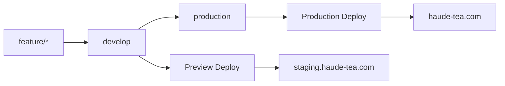

# Vercel 多環境部署指南 🚀

> 本指南詳細說明如何在 Vercel 上設置 production/develop 多環境部署策略

## 📋 目錄

- [部署架構概述](#部署架構概述)
- [環境分支對應](#環境分支對應)
- [Vercel Dashboard 設置](#vercel-dashboard-設置)
- [環境變數配置](#環境變數配置)
- [域名設置指南](#域名設置指南)
- [CI/CD 工作流程](#cicd-工作流程)
- [部署驗證](#部署驗證)
- [故障排除](#故障排除)
- [最佳實踐](#最佳實踐)

## 🏗️ 部署架構概述

### Git Flow + Vercel 部署策略



### 環境對應表

| Git 分支 | Vercel 環境 | 部署域名 | 用途 |
|---------|------------|----------|------|
| `production` | Production | haude-tea.com | 正式網站 |
| `develop` | Preview | staging.haude-tea.com | 測試環境 |
| `feature/*` | Preview | 自動生成預覽 URL | 功能開發 |
| `hotfix/*` | Preview | 自動生成預覽 URL | 緊急修復 |

## 🌿 環境分支對應

### Production 環境
- **分支**：`production`
- **觸發條件**：推送到 production 分支
- **部署域名**：主域名（haude-tea.com）
- **環境變數**：Production 環境變數
- **特點**：穩定、經過完整測試的代碼

### Preview 環境  
- **分支**：`develop`, `feature/*`, `hotfix/*`
- **觸發條件**：推送到任何非 production 分支
- **部署域名**：預覽 URL 或 staging 子域名
- **環境變數**：Preview 環境變數
- **特點**：測試新功能、實驗性代碼

## ⚙️ Vercel Dashboard 設置

### 第一步：專案設置

1. **登入 Vercel Dashboard**
   ```
   https://vercel.com/dashboard
   ```

2. **選擇專案 → Settings → Git**

3. **設置 Production Branch**
   ```
   Production Branch: production
   ```
   
   ⚠️ **重要**：確保選擇 `production` 而不是 `main`

### 第二步：分支部署設置

在 **Git** 設置頁面：

```yaml
Production Branch: production
Preview Branches: All other branches
```

### 第三步：自動部署設置

```yaml
✅ Auto-deploy on push
✅ Include preview deployments for pull requests
✅ Auto-expose environment variables
```

## 🔐 環境變數配置

### Production 環境變數

在 **Settings → Environment Variables**：

```env
# 環境設定
Environment: Production
Branches: production

# 變數設置
NEXT_PUBLIC_ENV=production
NEXT_PUBLIC_API_URL=https://api.haude-tea.com
NEXT_PUBLIC_SUPABASE_URL=your_production_supabase_url
NEXT_PUBLIC_SUPABASE_ANON_KEY=your_production_anon_key
SUPABASE_SERVICE_ROLE_KEY=your_production_service_role_key
JWT_SECRET=your_production_jwt_secret
```

### Preview 環境變數

```env
# 環境設定  
Environment: Preview
Branches: All other branches

# 變數設置
NEXT_PUBLIC_ENV=staging
NEXT_PUBLIC_API_URL=https://staging-api.haude-tea.com
NEXT_PUBLIC_SUPABASE_URL=your_staging_supabase_url
NEXT_PUBLIC_SUPABASE_ANON_KEY=your_staging_anon_key
SUPABASE_SERVICE_ROLE_KEY=your_staging_service_role_key
JWT_SECRET=your_staging_jwt_secret
```

### 環境變數管理技巧

```bash
# 使用 Vercel CLI 管理環境變數
vercel env add NEXT_PUBLIC_ENV production
vercel env add NEXT_PUBLIC_ENV staging --environment preview

# 檢視環境變數
vercel env ls

# 移除環境變數
vercel env rm VARIABLE_NAME
```

## 🌐 域名設置指南

### 主域名設置

在 **Settings → Domains**：

1. **添加生產域名**
   ```
   Domain: haude-tea.com
   Branch: production (自動對應)
   ```

2. **添加 www 重定向**
   ```
   Domain: www.haude-tea.com  
   Redirect to: haude-tea.com
   ```

### Staging 域名設置

```
Domain: staging.haude-tea.com
Branch: develop
```

### DNS 設置

在你的域名提供商設置以下記錄：

```dns
# A 記錄
Type: A
Name: @
Value: 76.76.19.61

# CNAME 記錄  
Type: CNAME
Name: www
Value: cname.vercel-dns.com

# Staging 子域名
Type: CNAME  
Name: staging
Value: cname.vercel-dns.com
```

## 🔄 CI/CD 工作流程

### 開發流程

```bash
# 1. 功能開發
git checkout develop
git pull origin develop
git checkout -b feature/new-cart

# 開發完成後推送
git push origin feature/new-cart
# ✅ 觸發：Preview 部署到臨時 URL

# 2. 合併到 develop
# 在 GitHub 創建 PR: feature/new-cart → develop
git checkout develop
git merge feature/new-cart  
git push origin develop
# ✅ 觸發：Preview 部署到 staging.haude-tea.com

# 3. 發布到生產環境
git checkout production
git merge develop
git push origin production  
# ✅ 觸發：Production 部署到 haude-tea.com
```

### 自動化部署觸發器

| 操作 | 觸發條件 | 部署環境 |
|------|----------|----------|
| `git push origin develop` | 推送到 develop | Preview |
| `git push origin production` | 推送到 production | Production |
| `git push origin feature/xxx` | 推送到功能分支 | Preview |
| GitHub PR 創建 | 創建 Pull Request | Preview |

## ✅ 部署驗證

### 檢查清單

#### Production 部署驗證

```bash
# 1. 檢查 URL 訪問
curl -I https://haude-tea.com
# 應該返回 200 OK

# 2. 檢查環境變數
# 在瀏覽器 console：
console.log(process.env.NEXT_PUBLIC_ENV)
// 應該輸出: "production"

# 3. 檢查 Vercel Dashboard
# 應該看到 Production 部署有皇冠圖標 👑
```

#### Preview 部署驗證

```bash
# 1. 檢查預覽 URL
# Vercel 會在 PR 或推送時提供預覽連結

# 2. 檢查 staging 域名
curl -I https://staging.haude-tea.com

# 3. 檢查環境變數
console.log(process.env.NEXT_PUBLIC_ENV)
// 應該輸出: "staging"
```

### 部署狀態監控

在 Vercel Dashboard 查看：

```
✅ Success - 部署成功
🟡 Building - 建置中  
❌ Failed - 部署失敗
🔄 Queued - 等待中
```

## 🔧 故障排除

### 常見問題

#### 1. 部署到錯誤環境

**症狀**：推送到 production 但部署為 Preview

**解決方案**：
```bash
# 檢查 Vercel Dashboard 設置
Settings → Git → Production Branch
確保設置為: production
```

#### 2. 環境變數未生效

**症狀**：環境變數在應用中無法讀取

**解決方案**：
```bash
# 確保變數名稱以 NEXT_PUBLIC_ 開頭（客戶端變數）
NEXT_PUBLIC_API_URL=https://api.example.com

# 重新部署以應用新的環境變數
vercel --prod
```

#### 3. 域名無法訪問

**症狀**：自定義域名返回 404

**解決方案**：
```bash
# 檢查 DNS 設置
nslookup haude-tea.com

# 檢查 Vercel 域名設置
Settings → Domains → 確認域名已驗證
```

#### 4. 建置失敗

**症狀**：部署過程中建置錯誤

**解決方案**：
```bash
# 本地測試建置
npm run build

# 檢查 Vercel 建置日誌
Dashboard → Deployments → 點擊失敗的部署查看詳細日誌
```

### 調試工具

```bash
# Vercel CLI 調試
vercel logs --follow
vercel inspect <deployment-url>

# 本地環境測試
vercel dev --debug
vercel build --debug
```

## 🎯 最佳實踐

### 分支管理

```bash
# ✅ 推薦做法
1. 在 develop 分支測試功能
2. 通過 PR 合併到 production  
3. 使用語義化提交訊息
4. 定期清理功能分支

# ❌ 避免做法
1. 直接推送到 production
2. 跳過 staging 環境測試
3. 混合不同功能在單一分支
```

### 環境變數管理

```bash
# ✅ 推薦做法  
1. 使用不同的 Supabase 專案（production/staging）
2. 敏感資料使用 Vercel 環境變數，不要寫在代碼中
3. 為不同環境使用不同的 API 端點
4. 定期輪換 API 密鑰

# ❌ 避免做法
1. 在代碼中硬編碼 API 端點
2. 所有環境共用同一資料庫
3. 將敏感資料提交到 Git
```

### 部署策略

```bash
# ✅ 推薦做法
1. 小批量、頻繁部署
2. 每次部署前在 staging 環境完整測試
3. 保持 production 和 develop 同步
4. 使用 feature flags 控制新功能

# ❌ 避免做法  
1. 大批量功能一次性部署
2. 跳過測試直接發布
3. 長期不同步分支
```

### 監控與維護

```bash
# 設置部署通知
vercel integrations --add slack
vercel integrations --add discord

# 定期檢查
1. 檢查部署成功率
2. 監控應用效能
3. 審查環境變數使用
4. 清理舊的預覽部署
```

## 📞 支援資源

### Vercel 文檔

- [Vercel Git Integration](https://vercel.com/docs/concepts/git)
- [Environment Variables](https://vercel.com/docs/concepts/projects/environment-variables)  
- [Custom Domains](https://vercel.com/docs/concepts/projects/domains)
- [Deployments](https://vercel.com/docs/concepts/deployments/overview)

### 常用指令

```bash
# Vercel CLI 指令
vercel login                    # 登入
vercel projects ls             # 列出專案
vercel domains ls              # 列出域名
vercel env ls                  # 列出環境變數
vercel logs <deployment-url>   # 查看日誌
vercel rollback <deployment-url> # 回滾部署
```

---

## 🎉 總結

通過本指南，你現在應該能夠：

- ✅ 設置 Vercel 多環境部署
- ✅ 管理不同分支對應的部署環境  
- ✅ 配置環境變數和域名
- ✅ 實施 CI/CD 工作流程
- ✅ 排除常見部署問題

記住：**production 分支 = 生產環境，所有其他分支 = 預覽環境**

> 💡 **小提示**：每次重要部署前，都建議先在 staging 環境完整測試！

---

*最後更新：2024-08-14*  
*維護者：豪德茶業開發團隊*